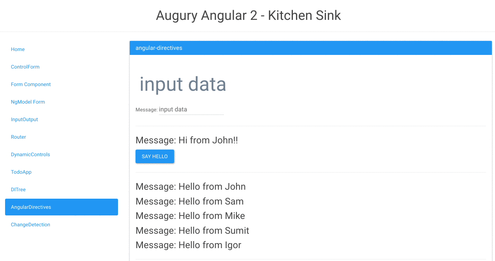

# Augury

[](https://circleci.com/gh/rangle/augury) [](https://augury-slack.herokuapp.com)
[](https://waffle.io/rangle/augury)

[Augury](https://augury.angular.io/) is a Google Chrome Dev Tools extension for debugging Angular 2 applications. You can install the extension from [Chrome Store](https://chrome.google.com/webstore/detail/augury/elgalmkoelokbchhkhacckoklkejnhcd).

Once the extenion is installed you can test it against the demo application https://augury.angular.io/demo/



## Supported Version

Currently works with applications built in [Angular 2.0.0-rc.5](https://github.com/angular/angular/blob/master/CHANGELOG.md#200-rc5-2016-08-09) using the Angular Component Router version `3.0.0-beta.2`.

To view the router graph inject the Router in the application root component as shown below (it must be named `router` exactly).
```js
export default class KitchenSink {
  constructor(private router: Router) {
  }
}
```
[Example](https://github.com/rangle/augury/blob/dev/example-apps/kitchen-sink-example/source/containers/kitchen-sink.ts)

## Join Our Slack Team

If you want to contribute or need help getting started, [join us on Slack](https://augury-slack.herokuapp.com).

## Development Environment

To develop this extension, the following environment is used:

* Node v4.2.6
* NPM 3.3.10
* TypeScript 1.7.5
* typings 0.6.8

## Building & Installing Locally

1. Clone this repository: `git clone git://github.com/rangle/augury`.
2. Run `npm install`.
3. Run `npm run dev-build`.
4. Navigate to chrome://extensions and enable Developer Mode.
5. Choose "Load unpacked extension".
6. In the dialog, open the directory you just cloned.

To try out the extension with an example application, refer to instructions in [README](./example-apps/kitchen-sink-example/README.md).

## Running Tests

To execute all unit tests, run `npm test`. It bundles up all files that match `*.test.ts` into `build/test.js`, then runs it through tape-run in a headless Electron browser.

## Available NPM Scripts

- `build` Build the extension
- `webpack` Run webpack
- `clean` Clean `node_modules` and `typings`,
- `postinstall` install typings
- `start` Clean build and run webpack in watch mode
- `test` Bundle all *.test.ts and run it through a headless browser
- `prepack` Run npm build before running npm pack
- `pack` Packages the extension and create chrome build augury.crx

## Developer Information

- [Developer guide](https://github.com/rangle/augury/wiki)
- [Contributing guidelines](CONTRIBUTING.md)
- [Architecture of this extension](./docs/ARCHITECTURE.md)

## License
[MIT](LICENSE)
