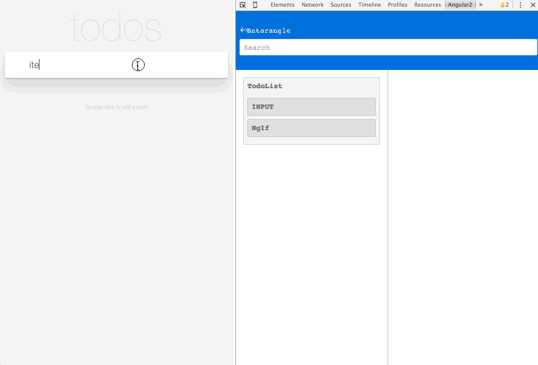

# Angular 2.0 Batarangle

 

Batarangle is a Google Chrome Dev Tools extension for debugging Angular 2 applications. Treat this as a "developer preview". Until the official release, please follow instructions below to build the tool locally and install it from source. It's actually quite easy.

## Supported Version

Currently works with applications built in [Angular 2.0.0-beta.11](https://github.com/angular/angular/blob/master/CHANGELOG.md#200-beta11-2016-03-18) with _limited backwards compatibility_, which will change once Angular 2 stabilizes.

## Join Our Slack Team

If you want to contribute or need help getting started, [join us on Slack](https://batarangle-slack.herokuapp.com).

## Getting Extension

You can get the extension in two ways:

1. If you just want to use the extension you can get the latest master build, which is packaged and hosted on every successful build of master branch on CircleCI
 * To download the latest build go to [Batarangle.io](http://batarangle.io) and click install
 * After download is complete go to Chrome Extensions `chrome://extensions` in the Chrome
 * Drag and Drop the downloaded package to install the extension

2. If you want to download the source code and build it manually
 * Clone the repo and install all the dependencies required
 * Run command `npm run pack`
 * This will generate `batarangle.crx` in the source folder
 * Then go to Chrome Extensions `chrome://extensions` in the Chrome
 * Drag and Drop the bundled package to install the extension

## Development Environment

To develop this extension, the following environment is used:

* Node v4.2.1
* NPM 3.3.10
* TypeScript 1.7.5
* typings 0.6.8

## Trying out the extension

1. Clone this repository: `git clone git://github.com/rangle/batarangle`.
2. Run `npm install`.
3. Run `npm run build` (errors related to typing files conflicts can be ignore for now).
4. Navigate to chrome://extensions and enable Developer Mode.
5. Choose "Load unpacked extension".
6. In the dialog, open the directory you just cloned.

To try out with an example application, refer to instructions in [README](./example-apps/todo-mvc-example/README.md).

## Running Tests

To execute all unit tests, run `npm test`. It bundles up all files that match `*.test.ts` into `build/test.js`, then runs it through tape-run in a headless Electron browser.

## Available NPM Scripts

- `build` Build the extension
- `webpack` Run webpack
- `clean` Clean `node_modules` and `typings`,
- `postinstall` install typings
- `start` Clean build and run webpack in watch mode
- `test` Bundle all *.test.ts and run it through a headless browser
- `prepack` Run npm build before running npm pack
- `pack` Packages the extension and create chrome build batarangle.crx

## Developer Information

- [Developer guide](https://github.com/rangle/batarangle/wiki)
- [Contributing guidelines](CONTRIBUTING.md)
- [Architecture of this extension](./docs/ARCHITECTURE.md)

## Future Plans

We are working hard towards [the official release](https://github.com/rangle/batarangle/releases). But at the mean time, you can take a look at our [milestones](https://github.com/rangle/batarangle/milestones) to see what new features are in place.

## License
[MIT](LICENSE)
