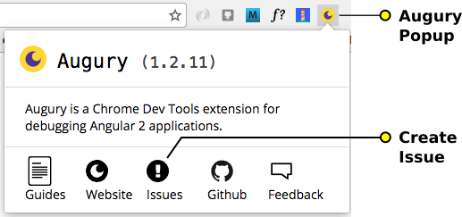

# Angular DevTools
With the release of Angular DevTools, Augury is not being maintained. Please download Angular DevTools from [Chrome Web Store](https://chrome.google.com/webstore/detail/angular-developer-tools/ienfalfjdbdpebioblfackkekamfmbnh) and use [rangle/angular-devtools](https://github.com/rangle/angular-devtools) repo to log any issues.

Read More about the release:
* [Introducing Angular DevTools](https://blog.angular.io/introducing-angular-devtools-2d59ff4cf62f)
* [Introducing the New Angular DevTools](https://rangle.io/blog/angular-devtools)


## Augury

[](https://circleci.com/gh/rangle/augury) [](https://augury-slack.herokuapp.com)

> Check out the [Augury Labs](https://github.com/rangle/augury-labs) project for new experimental Angular developer tools.

## Table of content

1. [Introduction](#introduction)
1. [Supported version](#supported-version)
1. [Working on Augury](#working-on-augury)
1. [Building and installing locally](#building-and-installing-locally)
1. [Running tests](#running-tests)
1. [Reporting issues](#reporting-issues)
1. [Contributing](#contributing)
1. [Known issues](#known-issues)

## Introduction

[Augury](https://augury.angular.io/) is a Chrome & Firefox Developer Tools extension for debugging Angular 2+ applications.

You can install the extension from:

- [Chrome Store](https://chrome.google.com/webstore/detail/augury/elgalmkoelokbchhkhacckoklkejnhcd)
- [Firefox Add-ons](https://addons.mozilla.org/en-US/firefox/addon/angular-augury)

You may also install our [Canary Build](https://addons.mozilla.org/en-US/firefox/addon/angular-augury) for Chrome to try out new features and bug fixes, and help us with user acceptance testing.

## Inspecting Code

Augury only works with Angular 2+ applications. A hard requirement is that the Angular application is running in development mode, this is due to a security restriction. If you plan to read the original source code, it is a good idea to generate source maps. Otherwise you will be forced to work with the compiled JavaScript code.

## Supported version

Augury works with application built starting with Angular 2+. Augury currently does not have support for Angular Ivy as of `Augury v1`.

---

## Working on Augury

### Development environment

To develop the Augury extension, the following environment is used:

- Node
- NPM
- TypeScript

### Building and installing locally

To install Augury locally, perform the following steps:

```bash
git clone git://github.com/rangle/augury
cd augury
npm install
npm run build:dev
```

Try out the extension with one of the example app from the [Guide](https://augury.angular.io/pages/guides/).

#### Chrome

1. Navigate to `chrome://extensions` and enable Developer mode.
1. Choose "Load unpacked extension".
1. In the dialog, open the directory you just cloned.

#### Firefox

1. Navigate to `about:debugging#addons` to load add-on.
1. Click Load Temporary Add-on
1. In the dialog, open the directory you just cloned, and select the `manifest.json` file.

### Running tests

#### Automated testing

To execute all unit tests, run `npm test`. It bundles up all files that match `*.test.ts` into `build/test.js`, then runs it through tape-run in a headless Electron browser.

#### Manual Testing

If you currently have the Augury extension installed from the Chrome Web Store or Firefox Add-ons, you can manually test your change by switching between your local dev production and production version of Augury in the extension window of your browser. Only one version of the tool should be active at a time.

### Available NPM scripts

To see all available script type `npm run` in the terminal. The following command are the ones you will mostly be working with.

| Command   | Description                                                 |
| --------- | ----------------------------------------------------------- |
| `start`   | Clean build and run webpack in watch mode                   |
| `webpack` | Runs webpack in watch mode                                  |
| `build`   | Builds the extension                                        |
| `clean`   | Clean the `build` directory,                                |
| `test`    | Bundle all \*.test.ts and run it through a headless browser |
| `lint`    | Run `tslint` on all source code                             |
| `pack`    | Packages the extension for browser specific builds          |

## Reporting issues

Please search to make sure your issue is not already been reported.

You should report an issue directly from Augury, by clicking on the Augury icon next to the address bar in the browser. It will open up a popup menu with a link to Issue reporting.



## Contributing

### General guidelines

If you'd like to help out, please read our [Contributing Guidelines](https://augury.angular.io/pages/guides/contribute.html).

### Augury Architecture

You might want to first checkout the [Architecture of this extension](https://augury.angular.io/pages/guides/architecture.html).

### Join on Slack

If you want to contribute or need help getting started, [join us on Slack](https://augury-slack.herokuapp.com).

---

# Known issues

## Router graph

The router injection technique described below applies to version before those listed below:

```
Angular v2.3.0
Angular Router v3.3.0
Augury v1.2.8
```

To be able to view the router graph, you will need to inject the Router in the application _Root_ component as shown below (it must be named `router` exactly).

```js
export default class KitchenSink {
  constructor(private router: Router) {
  }
}
```

[Example code](https://github.com/rangle/augury/blob/dev/example-apps/kitchen-sink-example/source/containers/kitchen-sink.ts#L75)

## Support for AoT (Ahead-Of-Time) compilation

In order for Angular to expose the debug information for AoT applications, you will have to explicitly set the debug flag to `true` in your project's `tsconfig.json` as such:

```json
"angularCompilerOptions": {
  /* ... */
  "debug": true
}
```

_Note_: This debug flag and `development mode` in Angular runtime are two completely different settings.

To learn more about AoT compilation, visit [this section of Angular documentation](https://angular.io/docs/ts/latest/cookbook/aot-compiler.html).

## Support for `enableDebugTools()`

Prior to [Angular 2.2.0](https://github.com/angular/angular/blob/master/CHANGELOG.md#220-upgrade-firebooster-2016-11-14), `enableDebugTools()` would clobber `ng.probe`, which breaks Augury. Prior to that version, [this workaround](https://github.com/AngularClass/angular2-webpack-starter/blob/dbb7d10e6e84b8e88116d957f0047b422ab807c1/src/app/environment.ts#L28...L36) will circumvent the issue.

## `No state` for some components

The date polyfill `core-js/es6/date` can throw an exception when stringifying a component. To workaround this issue, exclude this polyfill in your development environment.

### License

[MIT](LICENSE)
