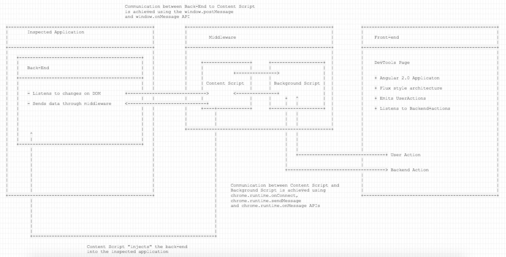

# Batarangle Architecture

The architecture of the Batarangle dev tools extensions can be broken down into 3 parts:

1. **Front-end**: displays the component view of the inspected application and other debugging information.
2. **Middleware**: communication between the inspected application and the dev tools.
3. **Backend**: lives in the context of the inspected application and notifies the dev tools of any changes to the inspected application through the middleware.

## Frontend

The front-end is an Angular 2.0 application in its own right that lives in the chrome dev tools context. It is based on our version of the Flux architecture.

There is a component data store that is notified of the changes in the inspected application through the middleware, and exposes an RxJS stream with the data representing the current component tree of the inspected application.
Angular 2.0 components that compose the dev tools view, listen to the stream exposed by the store and update the view accordingly. In order to be notified to the changes to the inspected application the store subscribes to the BackendActions represented by it's own class.

The front-end also has an ability to send messages to our backend via the UserActions. Together BackendActions and UserActions constitute an abstraction that allows the extension to communicate with the backend in a bi-directional manner.

## Middleware

The middleware layer consists of a background and a content scripts, but entities available in the chrome extensions. Both are defined in the manifest.json file of the extension.

1. Content script shares the DOM with an inspected application, but not the javascript execution context. This script is primarily used to "inject" our backend into the inspected application context, using the shared access to DOM.
2. Event script (or background script) allows for the bi-directional communication between the content script and the front-end. More on communication below.

Relevant documentation on Chrome Dev Tools API.

* [Extending DevTools](https://developer.chrome.com/extensions/devtools)
* [Event Pages](https://developer.chrome.com/extensions/event_pages)
* [Content Scripts](https://developer.chrome.com/extensions/content_scripts)

### Communication Between Content Script to/from the Dev Tools Page

The communication between the content script and the dev tools page (front-end) is achieved by using the `chrome.runtime.onConnect`, `chrome.runtime.sendMessage` and `chrome.runtime.onMessage` APIs.

Our event page (background script) acts as a bridge for that communication, it keeps track of the tab id from which the messages come and ensure that the correct instance of dev tools has received the message based on the tab id that is being inspected. The approach is described in [Messaging from Content Scripts to the DevTools Page](https://developer.chrome.com/extensions/devtools#content-script-to-devtools)

## Backend

Our inspected application load, our content script described above "injects" our backend into the context of an inspected application, by appending a `<script>` tag referencing the backend script to the DOM of the inspected application. This is possible due to the fact that our content script has access to the DOM of the inspected application.

Once injected, the backend uses the [MutationObserver](https://developer.mozilla.org/en/docs/Web/API/MutationObserver) DOM API to listen on changes to elements with Angular 2.0 markers (more information below), process the changes, and send the information about the new state of the whole component tree to the front-end. As changes happen the backend uses the `inspectNativeElement` function (provided by the Angular 2.0 instance of the inspected application) to get the Angular 2.0 `DebugElement` object containing the information about the changed component.

**Note**: Our backend is somewhat of an experiment so as to get a better idea of what kind of API it would be useful to get straight from Angular 2.0. The future goal of this is to retrieve this information from the API of the framework, and get a better idea of what the shape of it could be.

## Summary

