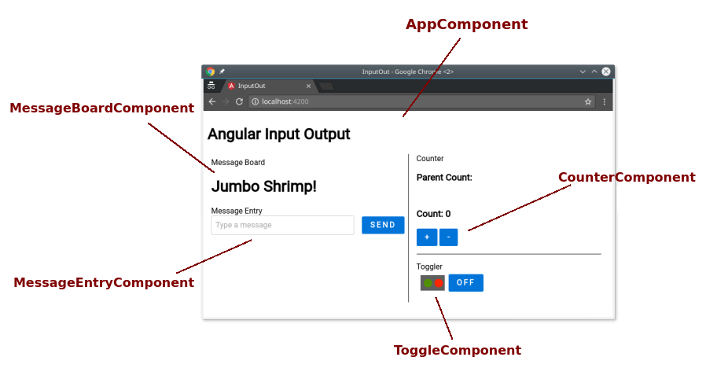
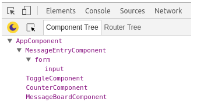
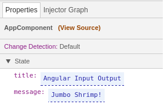
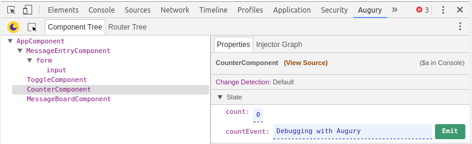
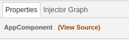
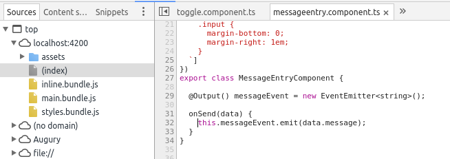
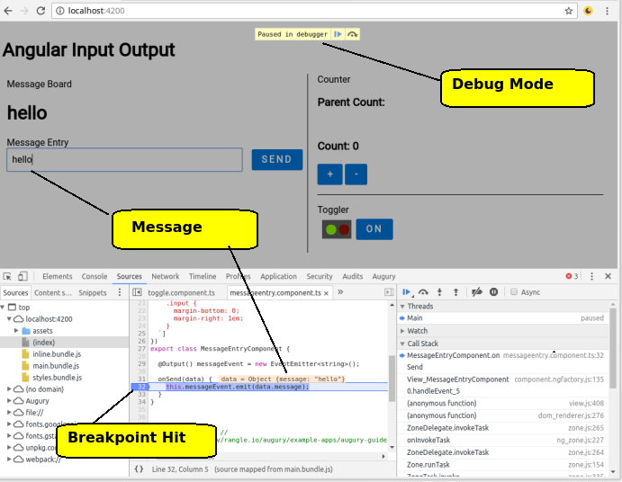

# Angular Input Output



## Description
The Input Output Angular App demonstrates passing data inside a component as well as across components. The app makes uses of Angular input and output decorators as well as event and data binding.

The IO App is composed of 5 components that are:

### Components

* Root Component
* Jumbo Message Board
* Message Entry
* Counter
* Toggle Button

## Architecture

The IO app Root component is AppComponent, it houses the other 4 components that each have a specific behaviour.

Component | Description
-----|------------
`AppComponent` | Root Component
`MessageBoardComponent` | Large message board.
`MessageEntryComponent` | Message entry form that emits a message.
`CounterComponent` | A counter that emits a count value.
`ToggleComponent` | Toggle button with state lights.

## Opening Augury
To use Augury, we need to open DevTools.

```
Ctrl + Shift + I (Cmd + Opt + I on Mac)
```

When DevTools is open, we select the **Augury** tab, located on the far right.

## Component View

Once Augury is opened, the component view is presented in the "Component Tree". It shows all the available components in the application, along with their parent-child relationship. Below we see the list of components discuss in the architecture section earlier.

The application root component `AppComponent` is listed at the top. Shifted slightly to the right and appearing under the root component are all the children components.



In code, a child component is a component that appears inside a component's `template`. If we peek at the file `app.component.html`, we'll see.

**Edited For Readability**

```
...
    <div>
      <app-messageboard></app-messageboard>
    </div>
...
    <div>
      <app-messageentry></app-messageentry>
    </div>
...
      <div>
        <app-counter></app-counter>
      </div>
...
      <app-toggle></app-toggle>
```

If we select `AppComponent` inside the "Component Tree", to the left inside the "Properties" tab we see the Component's properties under the "State" group.



If you've looked through the example code for IO App, you will notice there is one property missing, that being the property `count`.


**app.component.ts**
```js
@Component({
  selector: 'app-root',
  templateUrl: './app.component.html',
  styleUrls: ['./app.component.css']
})
export class AppComponent {
  title = 'Angular Input Output';
  count: number;

  @Input() message = "Jumbo Shrimp!";

  ...
}
```

Augury will not show properties in a component if it has not be assigned a value, since TypeScript will simply compile it out. It's therefore suggested you assign a proper default value to each property. Having a property with an undefined value is poor coding practice and is an anti-pattern.


**Don’t**
```js
class Foo {
   name: string;
}
```

**Do**
```js
class Foo {
  name: string = "";
}
```

In our example IO App, we've intentionally declared a property count with no assigned value to demonstrate the behaviour you would see in Augury. If you're not aware of why a property failed to appear, you might be confused.

However if we click on one of the counter buttons, this will initialize the count property with a value.

## Editing Properties

In the Properties tab, under State, editable property value will be displayed with a dashed underline. Let's change the `title` property of `AppComponent`.

1. Select `AppComponent` from Component Tree tab.
1. Click on the text to the right of `title` from the Properties tab.
1. Type "IO App" followed by the [Enter] key.


## Firing Events

The IO App has two components that emit an event. The `CounterComponent` and `MessageEntryComponent` have a event property decorated with `@Output()`, which has an `EventEmitter` attached to it.

We'll look at `MessageEntryComponent`, start by selecting the component. In the Properties tab, you will notice `messageEntry` under State. Click and type a message, like "Debugging with Augury" and click on the Emit button.



You will notice in the IO App, under "Message Board" the new message is displayed. By clicking on the Emit button, an event was fired-off, in particular an event called `messageEvent`.

## Viewing Source Code

Augury provides a quick and convenient way to jump to the source code of a selected Component. To do this, click on the "View Source" link, it's located in the Properties tab.



Following along from the previous step, with `MessageEntryComponent` slelected, click on "View Source". This will bring up the source code in DevTools by switching to the "Sources" tab.

Earlier under section "Firing Events" we emitted the `messageEvent` event. Looking at the source code, we can see this property is defined with the `@Output()` decorator.



If we want to convince ourselves that an event was triggered, we can set a breakpoint inside the event handler `onSend()` and emitt a new event.



This concludes our journey of looking at the IO App with Augury! You should now feel more comfortable debugging input, output, property binding and events in an Angular app.

### The Augury Team!

[Copyright notice etc.]
